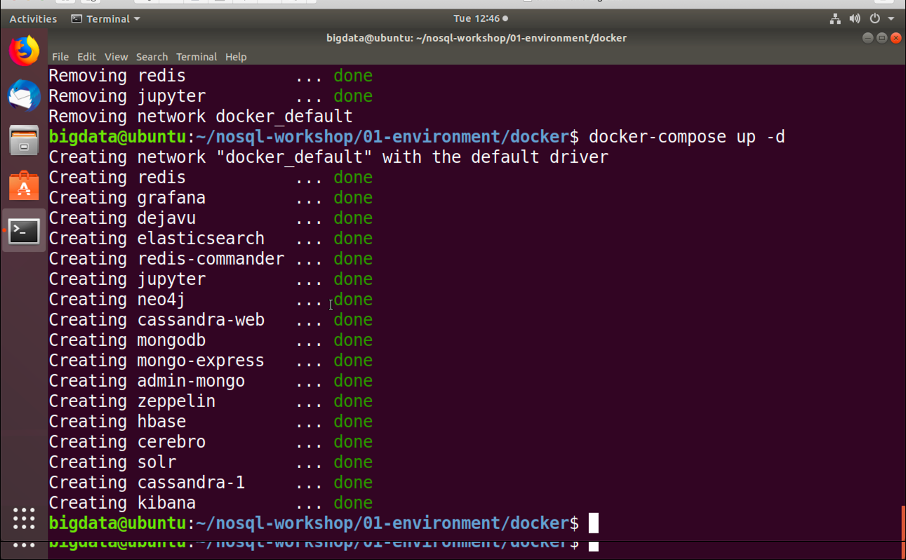
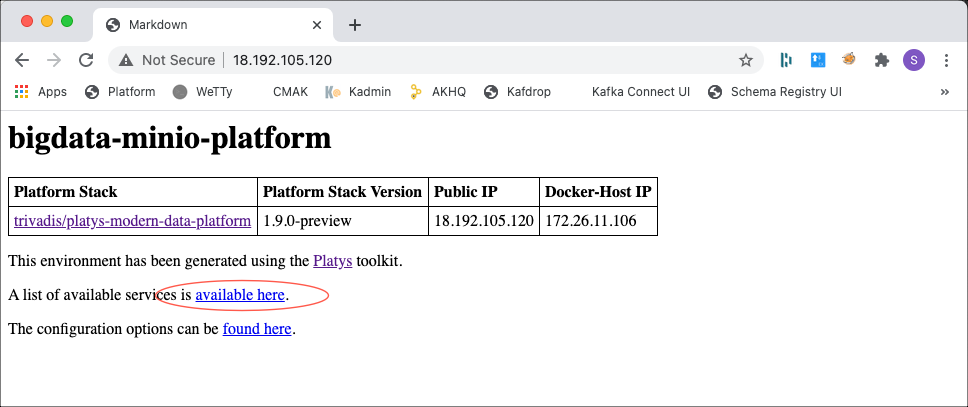
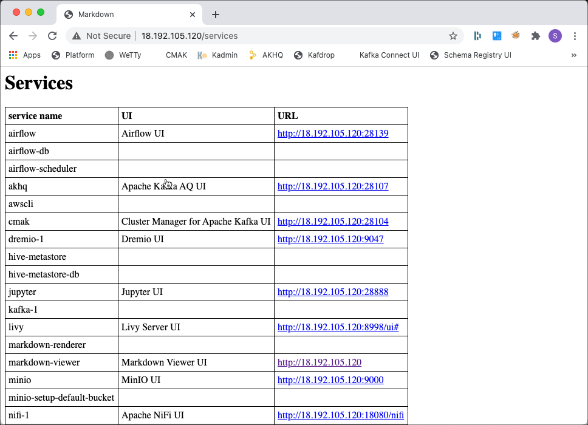

# Virtual Machine Environment

In this document, we will provision the platform on an Ubuntu virtual machine, which can either be run on Windows or Mac OS-X or as a VM in a cloud environment. 

Open and start the Ubuntu Virtual Machine either by using **VMWare Workstation** on Windows or **VMWare Fusion** on Mac or **Virtual Box**. 

Currently the VM is configured to use 14 GB of Memory. If you have less than 16 GB in total available on your system, make sure to reduce it before starting the virtual machine. 

## Prepare Environment

In the Virtual Machine, start a terminal window and execute the following commands. 

First let's add the environment variables. Make sure to adapt the network interface `export NETWORK_NAME=ens33` according to your environment. You can retrieve the interface name by using **ipconfig** on windows or **ifconfig* on Mac/Linux. 

```
export NETWORK_NAME=ens33

# Prepare Environment Variables 
export PUBLIC_IP=$(curl ipinfo.io/ip)
export DOCKER_HOST_IP=$(ip addr show ${NETWORK_NAME} | grep "inet\b" | awk '{print $2}' | cut -d/ -f1)

# add alias "dataplatform" to /etc/hosts
echo "$DOCKER_HOST_IP     dataplatform" | sudo tee -a /etc/hosts
```

Now install docker and docker compose if not yet available.

```
# Install Docker
curl -fsSL https://download.docker.com/linux/ubuntu/gpg | sudo apt-key add -
add-apt-repository "deb [arch=amd64] https://download.docker.com/linux/ubuntu $(lsb_release -cs) stable edge"
apt-get install -y docker-ce
sudo usermod -aG docker $USERNAME

# Install Docker Compose
curl -L "https://github.com/docker/compose/releases/download/${DOCKER_COMPOSE_VERSION}/docker-compose-$(uname -s)-$(uname -m)" -o /usr/local/bin/docker-compose
chmod +x /usr/local/bin/docker-compose
ln -s /usr/local/bin/docker-compose /usr/bin/docker-compose
```

Install platys as well as other utilities.

```
# Install Platys
sudo curl -L "https://github.com/TrivadisPF/platys/releases/download/${PLATYS_VERSION}/platys_${PLATYS_VERSION}_linux_x86_64.tar.gz" -o /tmp/platys.tar.gz
tar zvxf /tmp/platys.tar.gz 
sudo mv platys /usr/local/bin/
sudo chown root:root /usr/local/bin/platys
sudo rm /tmp/platys.tar.gz 

# Install various Utilities
sudo apt-get install -y curl jq kafkacat tmux
```

For Elasticsearch to run properly, we have to increase the `vm.max_map_count` parameter like shown below.  

```
# needed for elasticsearch
sudo sysctl -w vm.max_map_count=262144   
```

Make environment variables persistent

```
# Prepare Environment Variables into .bash_profile file
sudo echo "export PUBLIC_IP=$PUBLIC_IP" | sudo tee -a /etc/profile.d/platys-platform-env.sh
sudo echo "export DOCKER_HOST_IP=$DOCKER_HOST_IP" | sudo tee -a /etc/profile.d/platys-platform-env.sh
sudo echo "export DATAPLATFORM_HOME=$PWD" | sudo tee -a /etc/profile.d/platys-platform-env.sh
```

## Start Environment

And finally let's start the environment. For that navigate into the `docker` folder and execute the following command:

```
# Make sure that the environment is not running
docker-compose down

# Startup Environment
docker-compose up -d
```

The environment should start with downloading the necessary images from docker hub. 

The output should be similar to the one below. 



Your instance is now ready to use. 

Navigate to <http://<ip-addr>:80> and you should see a web page with the details of the platform, similar to the one below



If you click on the link for "Available services ..." then you should get a table similar to the one below, representing all the available user interfaces and REST APIs of the platform.



