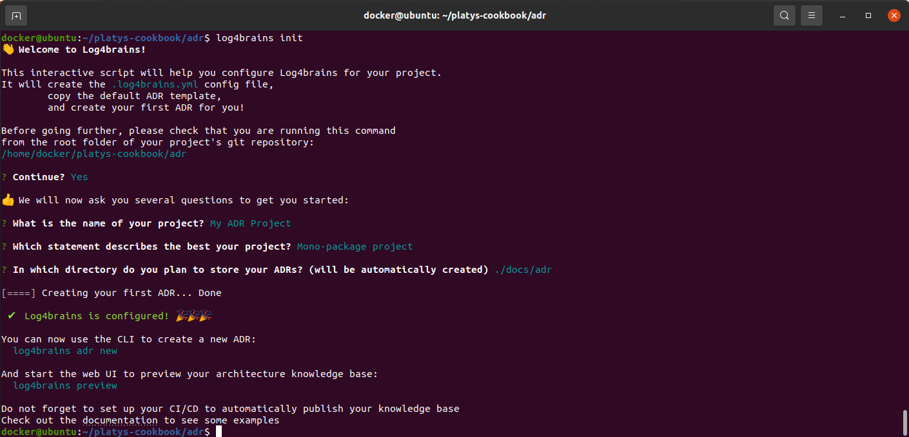
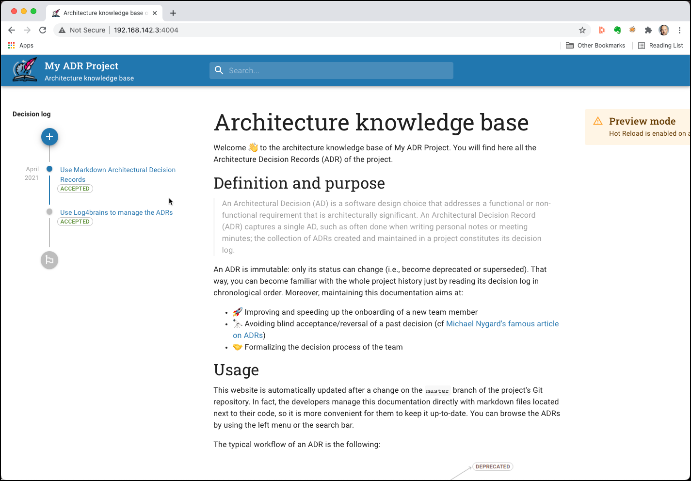
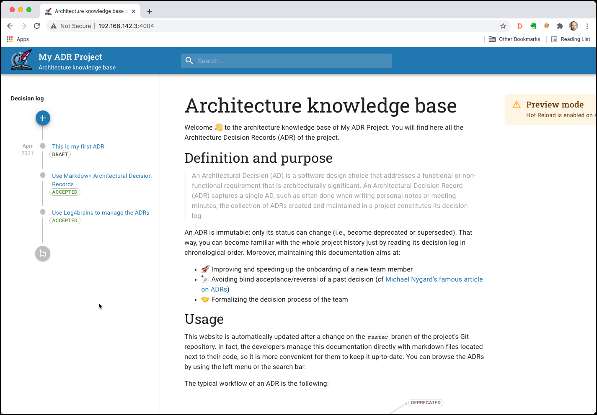
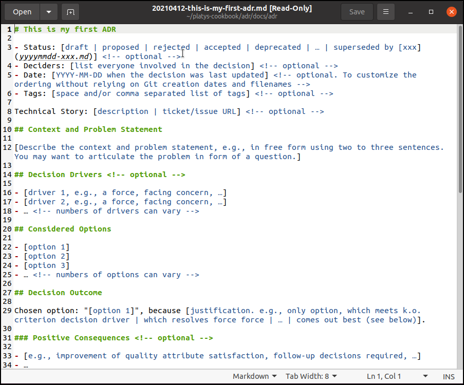

# Creating and visualising ADRs with log4brains

This recipe will show how to create and visualise Architecture Decision Records (ADR) using [log4brains](https://github.com/thomvaill/log4brains). 

If you want to know more on the concept of Architecture Decision Records (ADRs), there is a [Trivadis Platform Factory whitepaper](https://tvdit.sharepoint.com/:b:/r/sites/PlatformFactoryPublic/Shared%20Documents/Architecture%20Blueprints/Modern%20Data%20Architecture/wp-architecture-decision-record-v1.0d.pdf?csf=1&web=1&e=0BP76w) available (currently only in german). 

## Initialise a platform

First [initialise a platys-supported data platform](../../getting-started) with the following services enabled 

```bash
platys init --enable-services LOG4BRAINS,WETTY,MARKDOWN_VIEWER -s trivadis/platys-modern-data-platform -w 1.16.0
```

add the following property to the `config.yml`

```bash
LOG4BRAINS_adr_source_dir: './adr'
```

Now create the `adr` folder

```
mkdir adr
```

Now generate and start the data platform. 

```bash
platys gen

docker-compose up -d
```

For creating the ADR documents, you also may want to install log4brains locally (you need to have Node.js installed)

```
npm install -g log4brains
```

As an alternative you can also use the `log4brains` docker image and use a `docker run` for each of the commands (replace `<cmd>` by the log4brains command to use).

```
docker run -ti -v ${PWD}:/workdir thomvaill/log4brains <cmd>
```

## Create the log4brains ADR project 

Navigate to the `adr` folder created above

```
cd adr
log4brains init
```

if you want to use the docker image instead of the local log4brains installation, then perform

```
cd adr
docker run -ti -v ${PWD}:/workdir thomvaill/log4brains init
```

Answer the question asked by the tool as shown below



We can see that the following folder structure has been created. 

```
docker@ubuntu:~/platys-cookbook/adr$ tree
.
└── docs
    └── adr
        ├── 20210412-use-log4brains-to-manage-the-adrs.md
        ├── 20210412-use-markdown-architectural-decision-records.md
        ├── index.md
        ├── README.md
        └── template.md

2 directories, 5 files
```

With the init 2 sample ADRs were automatically created. They can be removed later.

Now with the ADR project being initialised, can restart the `log4brains` container

```
docker restart log4brains
```

Now navigate to <http://172.20.10.2:4004> and you should see two ADRs being rendered as a Web application.



## Create a new ADR

Navigate to the `adr` folder created above and run the `adr new` command

```
cd adr
log4brains adr new
```

if you want to use the docker image instead of the local log4brains installation, then perform

```
cd adr
docker run -ti -v ${PWD}:/workdir thomvaill/log4brains adr new
```

Answer the questions asked by the tool, such as the title and if the ADR is a new one or should supersede an existing one.

```
docker@ubuntu:~/platys-cookbook/adr$ docker run -ti -v ${PWD}:/workdir thomvaill/log4brains adr new

? Title of the solved problem and its solution? This is my first ADR

? Does this ADR supersede a previous one? No

 ✔  New ADR created: docs/adr/20210412-this-is-my-first-adr.md


? How would you like to edit it? Later
```

Because of the preview mode and its hot reload feature, the UI will automatically reflect the newly created ADR.



Edit the file `docs/adr/20210412-this-is-my-first-adr.md` in the Editor of your choice to define the ADR.



## Building a static website

Navigate to the `adr` folder created above and run the `build` command

```
cd adr
docker run -ti -v ${PWD}:/workdir thomvaill/log4brains build
```

After a while you should see the following output

```
docker@ubuntu:~/platys-cookbook/adr$ docker run -ti -v "${PWD}":/workdir thomvaill/log4brains build
Building Log4brains...
info  - Creating an optimized production build  
info  - Collecting page data  
info  - Finalizing page optimization  
[====] Generating search index... Done

 ✔  Your Log4brains static site was successfully generated to .log4brains/out with a total of 3 ADRs
```

The static website is available in `.log4brains/out`. Consult the [Log4brains GitHub](https://github.com/thomvaill/log4brains#-cicd-configuration-examples) to see examples on how deploy it to various static hosting services.
